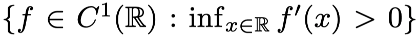
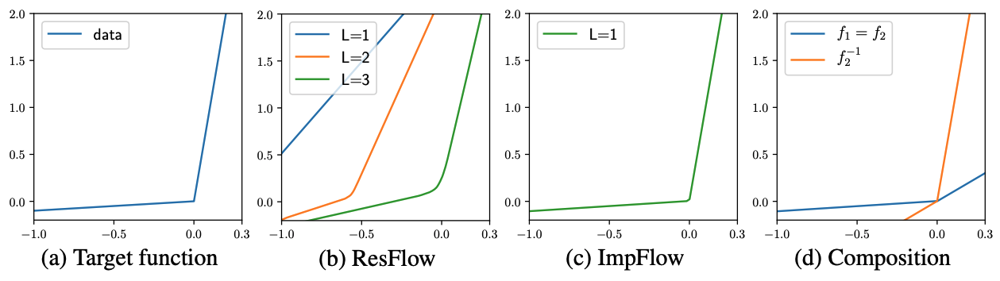

# Implicit Normalizing Flows (ICLR 2021 Spotlight)[[arxiv](https://arxiv.org/abs/2103.09527)][[slides](https://docs.google.com/presentation/d/1reCHEBjy9ygJ0bM_jvItEGU1jHDn7NfYBeC7FBqK-1Y/edit?usp=sharing)]

This repository contains Pytorch implementation of experiments from the paper [Implicit Normalizing Flows](https://arxiv.org/abs/2103.09527). The implementation is based on [Residual Flows](https://github.com/rtqichen/residual-flows).

<p align="center">

</p>

Implicit Normalizing Flows generalize normalizing flows by allowing the invertible mapping to be **implicitly** defined by the roots of an equation F(z, x) = 0. Building on [Residual Flows](https://arxiv.org/abs/1906.02735), we propose:

+ A **unique** and **invertible** mapping defined by an equation of the latent variable and the observed variable.
+ A **more powerful function space** than Residual Flows, which relaxing the Lipschitz constraints of Residual Flows.
+ A **scalable algorithm** for generative modeling.

As an example, in 1-D case, the function space of ImpFlows contains all strongly monotonic differentiable functions, i.e. 
<p align="center">

</p>

A 1-D function fitting example:

<p align="center">

</p>

## Requirements

 - PyTorch 1.4, torchvision 0.5
 - Python 3.6+

## Density Estimation Experiments

***NOTE***: By default, O(1)-memory gradients are enabled. However, the logged bits/dim during training will not be an actual estimate of bits/dim but whatever scalar was used to generate the unbiased gradients. If you want to check the actual bits/dim for training (and have sufficient GPU memory), set `--neumann-grad=False`. Note however that the memory cost can stochastically vary during training if this flag is `False`.

Toy 2-D data:
```
bash run_toy.sh
```

CIFAR10:
```
bash run_cifar10.sh
```

Tabular Data:
```
bash run_tabular.sh
```

## BibTeX
```
To be done after ICLR 2021.
```
